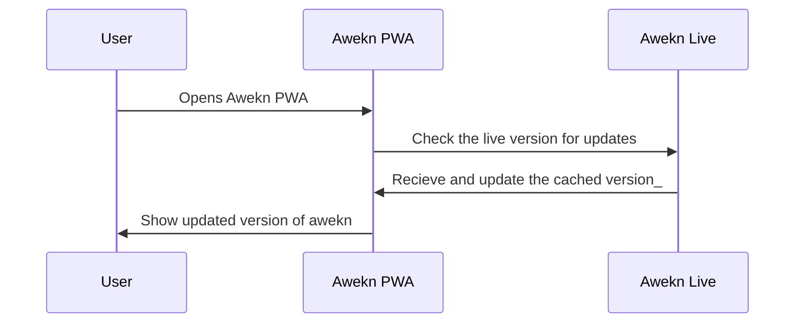

# Awekn
## Youtube Playlist Website


             

----

## Context
The idea of awekn originated because of my need for a product to hold my videos of interest. A product that is lightweight and organizes the videos categorized and curated. It started as a weekend project and ended as a weekend project. By bringing this project to GitHub and sharing it, I want to make it available for others to share and watch their favorite content.

This app currently has some basic options with support for PWA. It has support for user activities with a history of videos watched, and theme support locally. 

A simple Angular app and it would be great to see people extending this further.

`Live Demo` : <https://awekn.com>

----

#### Awekn Road Map

- [x] Awekn User Support
    - [x] Awekn User History Support
    - [x] Awekn User Theme Support
    - [x] Awekn User System Theme Support
- [x] Awekn Static Data Source Support
- [x] Awekn Dyanmic youtube thumbnail support
- [x] Awekn PWA
- [ ] Awekn Support for Multiple Backends
    - [ ] Awekn Support for SQLite
    - [ ] Awekn Support for strapi
    - [ ] Awekn Support for standard CMS
- [ ] Awekn Support for Custom players
    - [ ] Theme 1 Custom youtube player
    - [ ] Theme 2 Custom youtube player
                
----

### Awekn FlowChart

```flowchart TD

A[start] --> B[Check for updates]
B --> C{Updates available ?}
C --> |Yes| D[Update PWA]
D --> E[end]
C --> |No| E
```

### Awekn Sequence Diagram
                    



## Project by visrey

[](https://visrey.me "Visrey")

### Contact @ admin@visrey.me